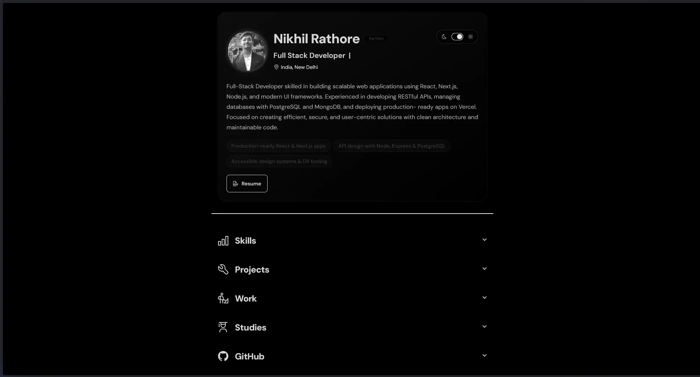

<div align="center">

# Nikhil Rathore — Portfolio

Personal portfolio site built with **Astro**, **Tailwind CSS** and **daisyUI**.
Content lives in Markdown, the site ships as static HTML, and everything is themeable, accessible and fast.

[**nikhilrathore.com**](https://nikhilrathore.com)

[](https://astro.build)
[](https://tailwindcss.com)
[](https://daisyui.com)
[](https://www.typescriptlang.org)
[](LICENSE)



</div>

---

## Contents

- [Features](#features)
- [Tech stack](#tech-stack)
- [Quick start](#quick-start)
- [Scripts](#scripts)
- [Project structure](#project-structure)
- [Editing content](#editing-content)
- [Environment variables](#environment-variables)
- [Deployment](#deployment)
- [Performance & SEO](#performance--seo)
- [Contributing](#contributing)
- [License & credits](#license--credits)

---

## Features

- **Markdown-driven content** — projects, work history, studies and contact links are plain `.md` files with frontmatter. No CMS, no database.
- **Accordion single-page layout** — Projects, Skills, Work, Studies and GitHub sections collapse and expand; Projects is open by default.
- **Project case-study pages** — every project Markdown file also renders as its own page (`/projects/<slug>`) with its own OG/Twitter tags, JSON-LD and links to the live site and repo.
- **Share buttons** — cards with a `url` get Twitter, LinkedIn, Facebook, Reddit and copy-link actions.
- **Light & dark themes** — daisyUI `lofi` / `black` themes, remembered in `localStorage`, with a circular-reveal transition via the View Transitions API (and a plain CSS fallback).
- **GitHub activity panel** — contribution graph plus live repo/follower/star counts fetched client-side from the public GitHub API.
- **Monthly visitor counter** — `/api/visitors` increments an Upstash Redis key per month (`Asia/Kolkata`), with an in-memory fallback so a storage outage never breaks the page.
- **Resume download** — served straight from `public/MyResume.pdf`, linked in the header.
- **Small touches** — scroll-progress bar, typewriter heading, animated favicon when the tab is hidden, console easter egg, back-to-top button, custom 404 page.
- **Accessibility & motion** — semantic landmarks, ARIA labels on interactive controls, and `prefers-reduced-motion` support throughout.

## Tech stack

| Layer | Choice |
| --- | --- |
| Framework | [Astro 5](https://astro.build) (`output: "static"`) |
| Styling | [Tailwind CSS](https://tailwindcss.com) + [daisyUI](https://daisyui.com) + `@tailwindcss/typography` |
| Icons | [astro-icon](https://www.astroicon.dev) with Carbon, MDI and Simple Icons sets |
| Fonts | Fontsource variable — DM Sans (body), Outfit (headings) |
| Build extras | `astro-compress` (HTML/CSS/JS/image minification), `@astrojs/sitemap` |
| Serverless | `api/visitors.js` — Vercel Function backed by Upstash Redis REST |
| Analytics | Vercel Analytics, Vercel Speed Insights, Umami |
| Self-hosting | Docker + Caddy (automatic HTTPS) |

## Quick start

**Prerequisites:** Node.js 20+ and npm.

```bash
git clone https://github.com/Dhirenderchoudhary/Portfolioo.git
cd Portfolioo

npm install
npm run dev
```

The dev server runs at **http://localhost:4321**.

No environment variables are needed for local development — the site builds and renders fully without them. The visitor counter simply returns its fallback value locally, since `/api/visitors` only runs on Vercel (see [Environment variables](#environment-variables)).

To check a production build locally:

```bash
npm run build     # outputs static files to dist/
npm run preview   # serves dist/ at http://localhost:4321
```

## Scripts

| Command | What it does |
| --- | --- |
| `npm run dev` | Start the dev server with HMR at `localhost:4321` |
| `npm start` | Alias for `npm run dev` |
| `npm run build` | Build the static site into `dist/` |
| `npm run preview` | Preview the built site locally |
| `npm run astro -- <cmd>` | Run any Astro CLI command (e.g. `npm run astro -- info`) |

## Project structure

```
.
├── api/
│   └── visitors.js           # Vercel Function: monthly visitor counter (Upstash Redis)
├── docs/
│   ├── CONTENT.md            # How to add/edit projects, work, studies, contact links
│   └── DEPLOYMENT.md         # Vercel and Docker + Caddy deployment guides
├── public/                   # Static assets served as-is (images, resume, favicon)
├── src/
│   ├── components/
│   │   ├── Card.astro          # Shared card used by every section
│   │   ├── Container.astro     # Reads the Markdown globs, sorts them, renders sections
│   │   ├── ContactCard.astro   # (currently unused)
│   │   ├── Footer.astro        # Contact links + credits
│   │   ├── GitHubActivity.astro
│   │   ├── Header.astro        # Avatar, typewriter intro, visitor counter
│   │   ├── ShareButtons.astro
│   │   └── Skills.astro        # Skill list (edit the array in this file)
│   ├── layouts/
│   │   ├── AccordionLayout.astro  # Collapsible section wrapper
│   │   └── ProjectLayout.astro    # Case-study page layout for /projects/*
│   ├── pages/
│   │   ├── about/about.md      # Name, designation, location, bio
│   │   ├── contact/*.md        # One file per contact link
│   │   ├── projects/*.md       # One file per project
│   │   ├── studies/*.md        # One file per education entry
│   │   ├── works/*.md          # One file per role
│   │   ├── 404.astro
│   │   └── index.astro         # Homepage: SEO meta, JSON-LD, script bootstrapping
│   ├── scripts/                # Client-side TS: theme, scroll, header, fun extras
│   └── styles/
│       ├── critical.css        # Inlined into <head> for LCP
│       └── shared.css
├── Caddyfile                 # Edge reverse proxy + TLS (self-hosted)
├── docker/Caddyfile          # Static file server inside the app container
├── Dockerfile
├── docker-compose.yml
└── astro.config.mjs
```

`Container.astro` picks up content with `import.meta.glob`, so **adding a Markdown file is all it takes** — no registry to update. Entries are sorted by year, newest first.

## Editing content

Everything visible on the site comes from a handful of Markdown files:

| To change… | Edit |
| --- | --- |
| Name, title, location, bio | `src/pages/about/about.md` |
| Projects | add a file in `src/pages/projects/` |
| Work history | add a file in `src/pages/works/` |
| Education | add a file in `src/pages/studies/` |
| Contact / social links | add a file in `src/pages/contact/` |
| Skills | the `skills` array in `src/components/Skills.astro` |

Full frontmatter reference and examples: **[docs/CONTENT.md](docs/CONTENT.md)**.

## Environment variables

Copy `.env.example` to `.env` when you need them. Nothing here is required to run the site locally.

| Variable | Required | Used by | Purpose |
| --- | --- | --- | --- |
| `UPSTASH_REDIS_REST_URL` | Optional | `api/visitors.js` | Upstash Redis REST endpoint for the visitor counter |
| `UPSTASH_REDIS_REST_TOKEN` | Optional | `api/visitors.js` | Upstash Redis REST token |

If the Upstash variables are missing, `/api/visitors` responds `200` with an in-memory fallback count and an `X-Counter-Source: fallback` header, so the UI degrades quietly instead of erroring.

## Deployment

**Vercel (current production setup)** — push to `main`. Vercel builds the static site and deploys `api/visitors.js` as a serverless function. Set the two Upstash variables in the project's environment settings.

**Docker + Caddy (self-hosted VM)** — `docker compose up -d --build` builds the static site and serves it behind Caddy with automatic HTTPS. Note that `/api/visitors` is a Vercel Function and is **not** part of this path; the counter falls back to its default value there.

Step-by-step instructions, DNS setup and troubleshooting: **[docs/DEPLOYMENT.md](docs/DEPLOYMENT.md)**.

## Performance & SEO

- Critical CSS is inlined into `<head>`; non-critical scripts are deferred to `requestIdleCallback`.
- The hero image is preloaded with `fetchpriority="high"`; all other images are `loading="lazy"` WebP.
- `astro-compress` minifies HTML, CSS, JS and images at build time.
- Every page ships canonical URLs, Open Graph and Twitter cards; the homepage adds `Person` JSON-LD and project pages add article metadata.
- `@astrojs/sitemap` generates `sitemap-index.xml` on each build.
- Preconnect/DNS-prefetch hints for the GitHub API and contribution-graph hosts.

## Contributing

Issues and pull requests are welcome — see **[CONTRIBUTING.md](CONTRIBUTING.md)** for local setup, conventions and the PR checklist.

## License & credits

Released under the [MIT License](LICENSE).

Originally based on an MIT-licensed Astro CV template by [mmouzo](https://github.com/mmouzo) (see the copyright line in [LICENSE](LICENSE)). Content, design and the features listed above are by [Nikhil Rathore](https://github.com/Blazeiscoding).
